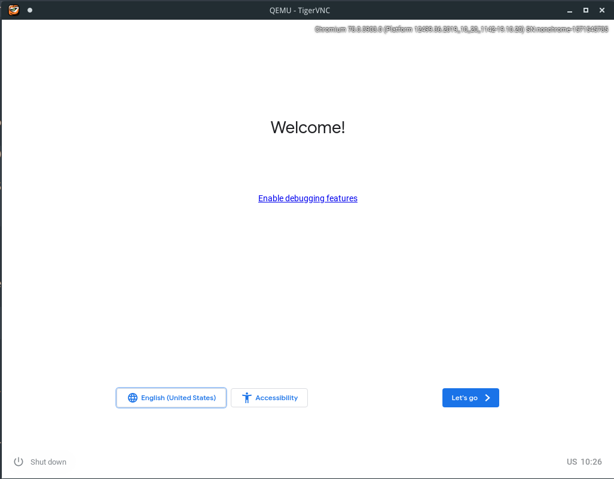
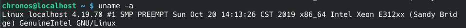
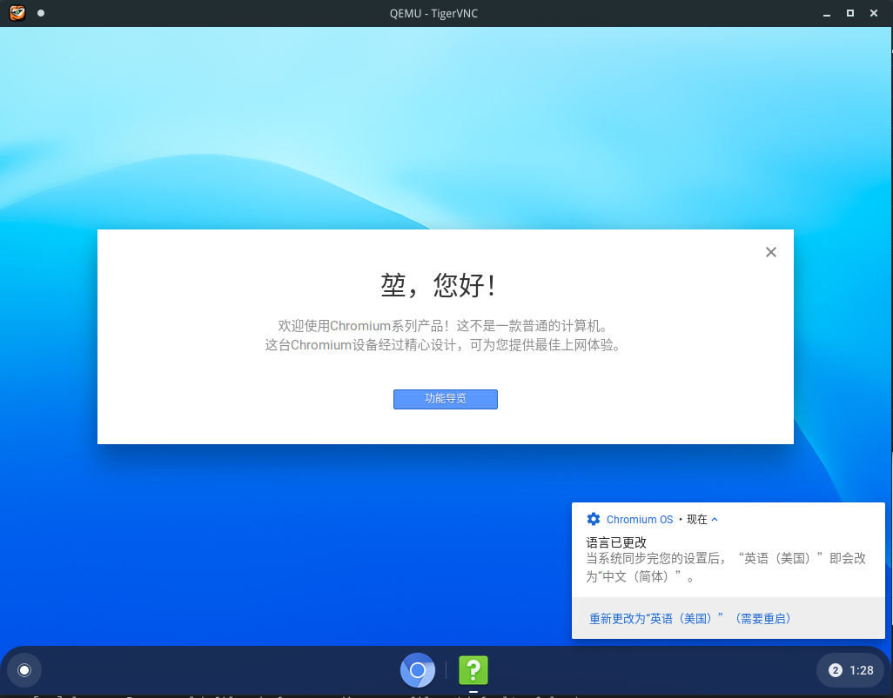
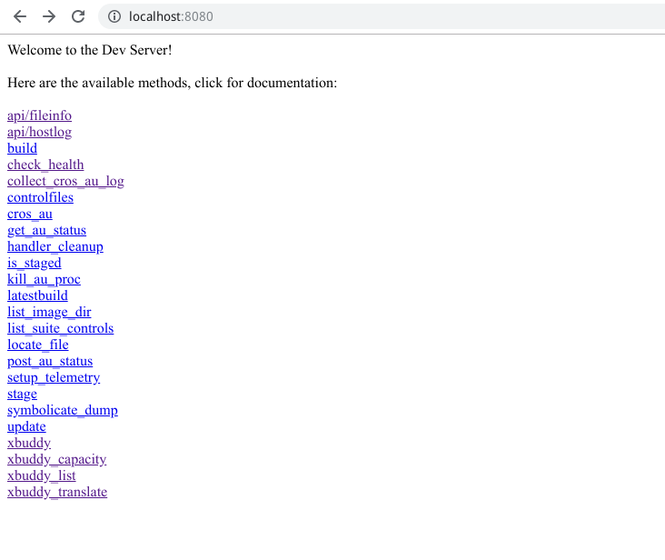
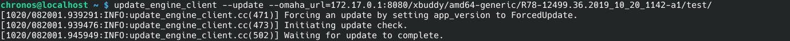

# Compilation And Hacks On Chromium OS 

## 0x00 Connectivity, tools & infrastructure readiness
### Network
#### proxychains

To download the chromium os source code, an proxy is needed. I have a server in advance, but it is complicated to do global proxy on Linux. At first I solved it by using:

```sh
proxychains -q bash
```
Any connections in bash process will be automatically proxyed.

> Notice: you can use proxychains to sync the source code in terminal, but it doesn't work after you enter the chroot environment.

#### redsocks2 + iptables

`redsocks2` is used to convert `socks5` tunnel, and `iptables` to redirect tcp requests 

#### /etc/hosts

If you do not have udp proxy, you'd better add the following items into your `/etc/hosts` (chroot)  so that  `gsutil.py`  could work.

```
172.217.12.208 commondatastorage.googleapis.com
172.217.12.176 storage.googleapis.com
172.217.12.138 www.googleapis.com
```

### Disk
 If you don't want to wast time, just use a solid state drive (SSD).

```sh
# mount  disk
sudo mount /dev/sda5 /path/to/your/mount/point -o rw,nodev,relatime,uhelper=udisks2
```
> Make sure there are no `nosuid` flag with your mounted disk.


## 0x01 Get Chromium OS code and start building

### Install depot_tools
On ArchLinux, you can install `depot_tools` using `yay`:
```sh
yay depot_tools
```
Adding `/opt/depot_tools` into your `PATH` env variable.  
> Notice: 
if you are using ArchLinux you need to run `repo_fix.sh` after `repo init` to fix `python2` reference

### Download chromium os source code
```sh
mkdir chromiumos 
cd chromiumos 
repo init -u https://chromium.googlesource.com/chromiumos/manifest.git --repo-url https://chromium.googlesource.com/external/repo.git
repo sync -j4
```
It will cost a long time.

refer: https://chromium.googlesource.com/chromiumos/docs/+/master/developer_guide.md

### Get your google api keys
refer: http://www.chromium.org/developers/how-tos/api-keys

Follow the link to get your **oauth2.0 client id** and **api key**. 

Save them and will be used later.

### Switch to release-R78-12499.B
Initially you may not in release-R78-12499.B branch, you can simply switch to it.
> This will not trigger a fully download.
```sh
repo init -b release-R78-12499.B
repo sync -j4
```


### Build Chromium OS
#### Enter chroot
Run `cros_sdk` to download and create a chroot environment
```sh
cros_sdk
```

`chroot` provides a virtual root file system, which may be a directory in your real file system. 
For `cros_sdk`, it setups environment and create a virtual root file system, with some build tools inside, and of course your source code.

You will be in `~/trunk/src/scripts` after executing `cros_sdk`. In fact,  `~/trunk/`was maped to your root directory(maybe `~/chromiumos/`) of your project. By pressing `ls` you can take a look at these scripts, which we will see them later.

The next cmd will delete the current chroot and install a new one. 

```sh
cros_sdk --replace
```
> Error: **ImportError: No module named pkg_resources**  
Make sure that you have python package `setuptools` installed.
Because repo is using python2, you should also check that you have installed it through `pip2`. 


#### Select a board
```sh
export BOARD=amd64-generic
```
Then run setup board
```sh
setup_board --force --board=amd64-generic
```
The flag`--force` will delete the previous one board file(would useful if you have to change your board type to make a new build)

#### Set "chronos" user passwd
```sh
./set_shared_user_password.sh
```

#### (Optinal) Some ways to speed up building
- Use SSD instead of HDD if disk speed becomes a bottleneck.
- Use SSD to "replace" some directory of HDD
If you only want to speed up the operation in some specific directory, you can use the `mount --bind` command to achieve it.
	1. copy the directory from HDD to SSD:
	```sh
	cp -ar -P /path/to/the/dir/on/HDD/ /path/to/hold/the/dir/on/SSD/
	```
	2. cover the directory on HDD:

	```sh
	sudo mount --bind /path/to/hold/the/dir/on/SSD/ /path/to/the/dir/on/HDD/
	```
- Use goma distributed compiler service
  goma is some kind of replacement of distcc+ccache. Through which you utilize a group of computers to build. 

  **goma-client**: program which hooks a compile request and sends it to a backend compile server  
  **goma-server**: program which works as a wrapper of backend service that implements the Remote Execution API.  
  **backend service**: program which execute the compile request, runs on many computers.  
  	eg:  
  	`Buildfarm` (which you should deploy by yourself)  
  	`Remote Build Execution` (based on GCP)  
https://chromium.googlesource.com/infra/goma/server/  
https://chromium.googlesource.com/infra/goma/client  
https://github.com/bazelbuild/remote-apis  

#### Build all packages
```sh
./build_packages --board=${BOARD}
```
> Notice: the build process of chromium may be difficult, you can use `emerge-${BOARD} --getbinpkgonly chromeos-chrome` to directly use the prebuilt version. refer: https://wiki.gentoo.org/wiki/Binary_package_guide  
> But in this way your api-keys will not be baked into your binary. You can also providing Keys at Runtime. refer: http://www.chromium.org/developers/how-tos/api-keys


#### Build image
```sh
./build_image --board=${BOARD} --noenable_rootfs_verification test
```
The `--noenable_rootfs_verification` flag will turn off verified boot. A `test` image accepts incoming ssh connections, and it also provides additional developer packages.

> Notice: If you build test image, the user passwd will be set to `test0000`.

Your image files will be located at `/mnt/host/source/src/build/images/{BOARD}}/latest/`


#### Build VM usable image
```sh
./image_to_vm.sh --test_image --board=${BOARD}
```
The flag `--test_image` will build VM usable image based on the `chromiumos_test_image.bin` under image directory instead of `chromiumos_image.bin`

The image file will be generated at  `/mnt/host/source/src/build/images/amd64-generic/latest/chromiumos_qemu_image.bin`

#### Run image via vm
```sh
cros_vm --start --image-path /mnt/host/source/src/build/images/amd64-generic/latest/chromiumos_qemu_image.bin
```
From the program output log, we know that:
- VNC server is running on `127.0.0.1:5900`
- sshd is listen on `127.0.0.1:9222`

#### Establish SSH connection
Connect using username `chronos` and password `test0000`
```
[imlk@imlk-pc ~]$ ssh -p 9222 chronos@127.0.0.1 
chronos@localhost ~ $ uname -a
Linux localhost 4.14.141-13420-gee2dd2c9d958 #1 SMP PREEMPT Fri Oct 18 18:21:48 CST 2019 x86_64 Intel Xeon E312xx (Sandy Bridge) GenuineIntel GNU/Linux
chronos@localhost ~ $ 
```

#### Establish VNC connection
A VNC client is need to connect to qemu. We use tigervnc to do it.
```sh
# on ArchLinux
yay tigervnc
```

Then connect to `127.0.0.1:5900`


Congratulation to yourself !

#### API-Keys
You can providing keys at runtime. Connect to your instance via ssh and execute:
```ssh
echo -e "GOOGLE_API_KEY=your_api_key\n\
GOOGLE_DEFAULT_CLIENT_ID=your_client_id\n\
GOOGLE_DEFAULT_CLIENT_SECRET=your_client_secret" >> /etc/chrome_dev.conf
```

## 0x02 Kernel replacement

#### Get the current kernel version info:
```
chronos@localhost ~ $ uname -a
Linux localhost 4.14.141-13420-gee2dd2c9d958 #1 SMP PREEMPT Fri Oct 18 18:21:48 CST 2019 x86_64 Intel Xeon E312xx (Sandy Bridge) GenuineIntel GNU/Linux
```
Now to replace with release version v4.19.

### (Method 1) Use ./update_kernel.sh
`./update_kernel.sh` is a shell script which use `ssh` to connect to your device and export the new Kernel files.

Assume that you had build vm image using default kernel and was able to run in qemu.
Now compile kernel v4.19:
```sh
cd ../../src/third_party/kernel/v4.19/
# unmerge the old version kernel-4_14
emerge-${BOARD} --unmerge chromeos-kernel-4_14
# flag that you are using chromeos-kernel-4_19 instead of the default one
cros_workon --board=$BOARD start sys-kernel/chromeos-kernel-4_19
# do use default configuration to start compile
cros_workon_make --board=${BOARD} sys-kernel/chromeos-kernel-4_19 --install

# start qemu instence and use ./update_kernel.sh to update kernel for this instence 
./update_kernel.sh --board=${BOARD} --remote=127.0.0.1 --ssh_port=9222 --private_key=/mnt/host/source/src/build/images/amd64-generic/latest/id_rsa
```






### (Method 2) Modify chromiumos_test_image.bin
This method is similar with Method 1, but I was failed to run on qemu. I finally got a qemu image file, but stuck at "Booting the kernel". 
One possible reason is that the files `./image_to_vm.sh` used to build vm image included something belong to the old Kernel.

Assume that you had build test image using default kernel.

Now compile kernel v4.19:

```sh
## partly same as method 1
cd ../../src/third_party/kernel/v4.19/
# unmerge the old version kernel-4_14
emerge-${BOARD} --unmerge chromeos-kernel-4_14
# flag that you are using chromeos-kernel-4_19 instead of the default one
cros_workon --board=$BOARD start sys-kernel/chromeos-kernel-4_19
# do use default configuration to start compile
cros_workon_make --board=${BOARD} sys-kernel/chromeos-kernel-4_19 --install


# mount the old image file
./mount_gpt_image.sh --noread_only --from /mnt/host/source/src/build/images/amd64-generic/latest/chromiumos_test_image.bin 

# remove some old kernel files to get more space
sudo find  /tmp/m/ -name "*4.14*"
sudo rm -rf /tmp/m/lib/modules/4.14.141-13420-gee2dd2c9d958/
sudo rm -rf /tmp/m/boot/vmlinuz-4.14.141-13420-gee2dd2c9d958
sudo rm -rf /tmp/m/mnt/stateful_partition/var_overlay/db/pkg/sys-kernel/chromeos-kernel-4_14-4.14.141-r883
sudo rm -rf /tmp/m/var/db/pkg/sys-kernel/chromeos-kernel-4_14-4.14.141-r883

# extra new kernel and skip kernel debug information
sudo tar vxpf /build/amd64-generic/packages/sys-kernel/chromeos-kernel-4_19-9999.tbz2 --exclude=./usr/lib/debug/* -C /tmp/m/ --overwrite
# unmount image
./mount_gpt_image.sh -u
# build vm image.
./image_to_vm.sh --test_image --board=${BOARD}
```

### Any other methods ?
I want to know if there are some better methods to apply another Kernel.
I have tried to manually unmerge the old kernel and merge the new Kernel, built I was failed execute `./build_image`:
```
emerge: there are no binary packages to satisfy "sys-kernel/chromeos-kernel-4_14" for /mnt/host/source/src/build/images/amd64-generic/R78-12499.36.2019_10_20_2049-a1/rootfs/.
(dependency required by "virtual/linux-sources-1-r18::chromiumos" [binary])
(dependency required by "virtual/target-chromium-os-1-r130::chromiumos" [binary])
(dependency required by "virtual/target-chrome-os-1-r23::chromeos" [binary])
(dependency required by "virtual/target-os-1.5-r1::chromeos" [binary])
(dependency required by "virtual/target-os" [argument])
```
There must be some mechanism which I don't know. I will try it another time.

## 0x03 CrOS devserver in docker

the `start_devserver` script is just a wrapper of `/usr/lib/devserver/devserver.py`, which belongs to `dev-util` project of Google

### Script
You can download this server by the following script:
```sh
sudo pip2 install cherrypy==3.2.2
sudo pip2 install psutil
git clone https://chromium.googlesource.com/chromiumos/platform/dev-util
git clone https://chromium.googlesource.com/chromiumos/chromite
cd dev-util && \
ln -s ../chromite ./
```
### Bug fix 

You man find that many of these tools in `cors_sdk` are old. apply those patchs to fix error occurring in `dev-util`:

**xbuddy.py**
```diff
diff --git a/xbuddy.py b/xbuddy.py
index 7747ef7..99e2d2b 100644
--- a/xbuddy.py
+++ b/xbuddy.py
@@ -220,8 +220,10 @@ class XBuddy(build_util.BuildObject):
			 self._ctx = gs.GSContext(cache_user='chronos') if gs else None
		 else:
			 self._ctx = gs.GSContext() if gs else None
-
-    common_util.MkDirP(self._timestamp_folder)
+    try:
+      common_util.MkDirP(self._timestamp_folder)
+    except Exception as e:
+      pass
 
	 @classmethod
	 def ParseBoolean(cls, boolean_string):
```

**common_util.py**
```diff
diff --git a/common_util.py b/common_util.py
index 6b5e15b..505b1f8 100644
--- a/common_util.py
+++ b/common_util.py
@@ -64,7 +64,7 @@ def MkDirP(directory):
       # Fix permissions and ownership of the directory and its subfiles by
       # calling chown recursively with current user and group.
       chown_command = [
-          'sudo', 'chown', '-R', '%s:%s' % (os.getuid(), os.getgid()), directory
+          'chown', '-R', '%s:%s' % (os.getuid(), os.getgid()), directory
       ]
       subprocess.Popen(chown_command).wait()
     else:
```

**cherrypy_ext.py**
```diff
diff --git a/cherrypy_ext.py b/cherrypy_ext.py
index 52e168d..7dc2bb3 100644
--- a/cherrypy_ext.py
+++ b/cherrypy_ext.py
@@ -148,6 +148,8 @@ class ZeroPortPatcher(object):
 
				 cls.cached_port = port
 
+      if host == '::':
+        host = '0.0.0.0'
			 if port:
				 return func(host, port)
```
refer: https://forums.sabnzbd.org/viewtopic.php?t=21074


### Dockerfile
```Dockerfile
############################################################
# Dockerfile to build ChromiumOS devserver container images
# Based on ubuntu
############################################################

FROM ubuntu

RUN sed --in-place --regexp-extended \
      "s/(archive\.ubuntu\.com)/mirrors.tuna.tsinghua.edu.cn\/ubuntu\//" /etc/apt/sources.list && \
    sed --in-place --regexp-extended \
    "s/(security\.ubuntu\.com)/mirrors.tuna.tsinghua.edu.cn\/ubuntu\//" /etc/apt/sources.list && \
    apt-get update 

RUN apt install -y python-pip && \
	apt install -y curl

RUN echo "[global] \
index-url = http://pypi.tuna.tsinghua/simple \
trusted-host = \
    pypi.tuna.tsinghua \
	timeout = 120 \
" > /etc/pip.conf

RUN mkdir devserver && \
	cd devserver && \
	pip install six && \
	pip install cherrypy==3.2.2 &&\
	pip install psutil

	# git clone https://chromium.googlesource.com/chromiumos/platform/dev-util && \
	# git clone https://chromium.googlesource.com/chromiumos/chromite && \
	# cd dev-util && \
	# ln -s ../chromite ./

RUN useradd -ms /bin/bash devserver-usr


COPY ./dev-util /devserver/dev-util
COPY ./chromite /devserver/chromite

RUN chown -R devserver-usr:devserver-usr /devserver/

USER devserver-usr

WORKDIR /devserver/dev-util

CMD ./devserver.py
```
### File tree view
```
.
├── chromite	(dir)
├── dev-util	(dir)
└── Dockerfile
```

### Build image and run

```sh
sudo docker build -t devserver-img .
sudo docker run -p 8080:8080 --rm -ti devserver-img
```
### Visit
Now you can open your browser and visit `http://localhost:8080/`



## 0x04 Connecting all the dots
### Modify `/etc/lsb-release`

- First, check our ip address by `ifconfig` on host:
```
docker0: flags=4163<UP,BROADCAST,RUNNING,MULTICAST>  mtu 1500
        inet 172.17.0.1  netmask 255.255.0.0  broadcast 172.17.255.255
        inet6 fe80::42:9aff:feb6:ae8e  prefixlen 64  scopeid 0x20<link>
        ether 02:42:9a:b6:ae:8e  txqueuelen 0  (Ethernet)
        RX packets 2323  bytes 198861 (194.2 KiB)
        RX errors 0  dropped 0  overruns 0  frame 0
        TX packets 4954  bytes 7880596 (7.5 MiB)
        TX errors 0  dropped 0 overruns 0  carrier 0  collisions 0
```
the host' ip is `172.17.0.1`

- Modify
```
# make / writable
sudo mount / -o remount,rw,relatime,seclabel
sudo vim /etc/lsb-release
```

### Start devserver
```sh
sudo docker run -p 8080:8080 --rm -ti  devserver
```
Test connection in CrOS instance
```
curl http://172.17.0.1:8080/
```


### Move payload into devserver
```sh
# create a new instance
(host) sudo docker run -p 8080:8080 --rm -ti devserver

# create dir to hold resource
(host) sudo docker exec -it 9b02b50a0bf9 "mkdir -p /devserver/dev-util/static/amd64-generic/R78-12499.36.2019_10_20_1142-a1/"

# copy image file into docker
(host) sudo docker cp ./disk/chromiumos/imgs/chromiumos_test_image.bin 028b9537aad3:/devserver/dev-util/static/amd64-generic/R78-12499.36.2019_10_20_1142-a1/
```
### file_path <=> xbuddy_path mapping
The mapping rule was not documented in Google's Guide. 
I found the rule by reading an error message. 

I made a http request `http://172.17.0.1:8080/xbuddy/amd64-generic/R78-12499.36.2019_10_20_1142-a1/test/`, an error message occurred and said that cannot find file names`/devserver/dev-util/static/amd64-generic/R78-12499.36.2019_10_20_1142-a1/chromiumos_test_image.bin`.

so that I found the mapping rule is:  
`http://172.17.0.1:8080/xbuddy/${board}/${version}/${image_type}/ <=> static_dir/${board}/${version}/chromiumos_${image_type}_image.bin`

### Do some test
- Test get resource list:
```sh
(docker) curl http://172.17.0.1:8080/xbuddy_list
<b>amd64-generic/R78-12499.36.2019_10_20_1142-a1</b>       (time since last access: 0:01:25.619931)<br>
```
- Test request specific file
```sh
(docker) curl http://172.17.0.1:8080/xbuddy/amd64-generic/R78-12499.36.2019_10_20_1142-a1/test/
This resource resides temporarily at <a href='http://172.17.0.1:8080/static/amd64-generic/R78-12499.36.2019_10_20_1142-a1/chromiumos_test_image.bin'>http://172.17.0.1:8080/static/amd64-generic/R78-12499.36.2019_10_20_1142-a1/chromiumos_test_image.bin</a>.
```
- Test `update_engine_client`
```sh
update_engine_client --update --omaha_url=172.17.0.1:8080/xbuddy/amd64-generic/R78-12499.36.2019_10_20_1142-a1/test/
```


refer:  
https://chromium.googlesource.com/chromiumos/docs/+/master/xbuddy.md
https://chromium.googlesource.com/chromiumos/chromite/+/master/docs/devserver.md
https://chromium.googlesource.com/chromiumos/platform/dev-util/+/master/devserver.py
